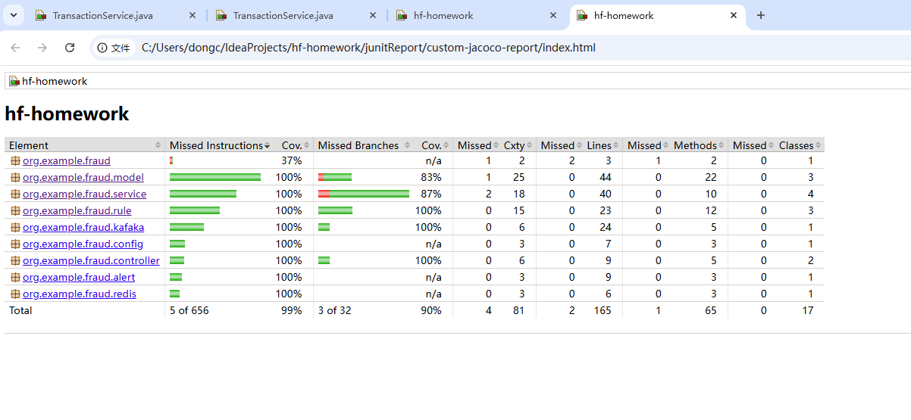
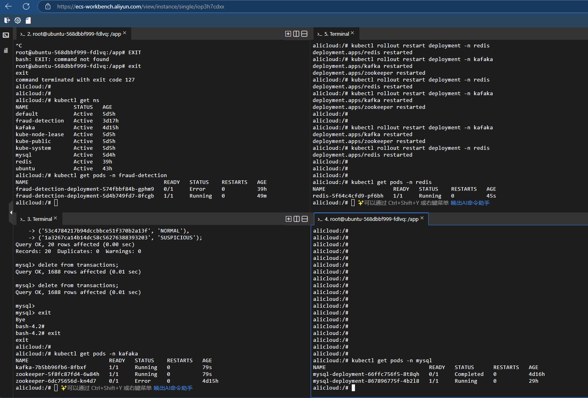
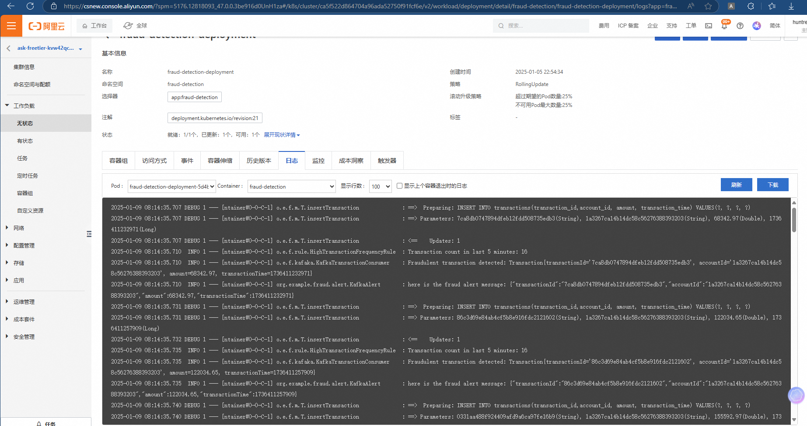
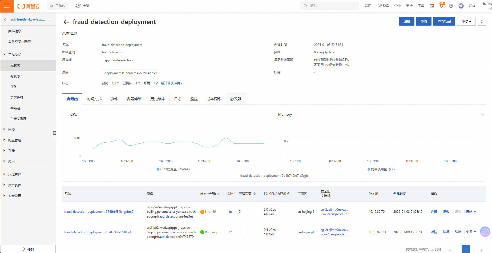

# 银行交易欺诈检测系统

## 项目背景

本项目旨在开发一个银行交易欺诈检测系统，通过基于规则引擎的方式，实时监控银行交易，快速检测是否存在欺诈行为。该系统能有效提高银行对可疑交易的处理效率，减少欺诈损失。项目基于Spring
Boot框架开发，结合Redis进行缓存优化，MySQL用于数据存储，Kafka处理消息队列，支持高并发数据流的实时处理。

---

## 技术栈

- **后端框架：** Spring Boot
- **数据库：** MySQL（用于存储用户、交易和规则数据）
- **缓存：** Redis（用于加速规则引擎查询和交易数据处理）
- **消息队列：** Kafka（用于处理实时交易数据流）
- **规则引擎：** 自定义的规则引擎，基于Java接口和继承类实现

---

## 系统架构

系统的整体架构包括以下两个模块：

- **规则引擎：** 基于Java接口和继承机制实现，支持灵活扩展欺诈检测规则。
- **告警设计：** 通过接口实现多种告警方式，如Kafka、邮件、短信等。

### 规则引擎模块设计

系统中的规则引擎基于三个主要的规则进行欺诈检测，每个规则都实现了 `Rule` 接口，接口中包含一个 `apply` 方法来判断交易是否符合欺诈检测的条件。

#### 规则接口（Rule）

```java
public interface Rule {
    boolean apply(Transaction transaction);

    String getRuleName();
}
```

1. **AmountRule（基于交易金额）**

        `AmountRule` 检查交易金额是否超过预设的阈值，若超过，则判定为可疑交易。

2. **HighTransactionFrequencyRule（基于交易频率）**

        `HighTransactionFrequencyRule` 通过检查同一账户在短时间内的交易频率，判断是否存在频繁交易的可疑行为。

3. **FraudulentAccountRule（基于账号）**

        `FraudulentAccountRule` 检查账户是否被标记为欺诈账户，若是，则判定为欺诈行为。

#### 规则引擎执行流程

当接收到一笔交易时，系统会依次调用每个规则的 `apply` 方法，判断该交易是否符合欺诈检测的条件。如果某个规则返回 `true`
，则系统将标记该交易为可疑或欺诈。

### 告警接口设计

在银行交易欺诈检测系统中，告警设计是一个重要的部分。通过设计一个 `Alert` 接口和其实现，可以为不同的告警机制提供灵活的扩展。

告警接口定义了一个统一的告警方法 `sendAlert`，接收一个 `Transaction` 对象作为输入，表示需要发送告警的交易。

#### 告警接口（Alert）

```java
public interface Alert {
    void sendAlert(Transaction transaction);
}
```

1. **Kafka告警**

        `KafkaAlert` 实现了 `Alert` 接口，用于将告警信息发送到 Kafka 消息队列中，以便后续处理。
2. **邮件告警实现（EmailAlert）**

        邮件告警实现（EmailAlert）是一个实现了 Alert 接口的类，用于发送邮件告警。在 sendAlert 方法中，它调用 EmailService 的 sendEmail 方法发送邮件。
3. **短信告警实现（SmsAlert）**

        短信告警实现（SmsAlert）是一个实现了 Alert 接口的类，用于发送短信告警。在 sendAlert 方法中，它调用 SmsService 的 sendSms 方法发送短信。
4. **HTTP Webhook告警实现（WebhookAlert）**

        HTTP Webhook告警实现（WebhookAlert）是一个实现了 Alert 接口的类，用于通过 HTTP Webhook 发送告警。在 sendAlert 方法中，它使用 RestTemplate 发送 HTTP POST 请求。

#### 告警执行流程

当某个交易通过规则引擎的验证后，如果被判定为可疑或欺诈，系统将执行告警操作。这时，您可以根据配置选择相应的告警实现（Kafka、邮件、短信等），并将该交易的相关信息发送出去。

---

## 细节设计

对于 `HighTransactionFrequencyRule`，提供的两种实现方式都可以有效检测短时间内的交易频率。每种方式有其优缺点，可以根据具体情况选择合适的实现方案。

### 1. 基于数据库查询的实现方式

这种方式依赖于MySQL数据库，使用 `BETWEEN AND` 查询来统计某个时间区间内的交易数量。这种方式简单易理解，但会有一些性能上的问题，尤其是在高并发情况下，频繁访问数据库可能会造成性能瓶颈。

#### 示例代码：

```java
public class HighTransactionFrequencyRule implements Rule {
    private static final int MAX_TRANSACTIONS_PER_HOUR = 5;  // 每小时最多允许的交易次数

    private final TransactionRepository transactionRepository;

    public HighTransactionFrequencyRule(TransactionRepository transactionRepository) {
        this.transactionRepository = transactionRepository;
    }

    @Override
    public boolean apply(Transaction transaction) {
        // 获取当前时间和过去1小时的时间戳
        LocalDateTime now = LocalDateTime.now();
        LocalDateTime oneHourAgo = now.minusHours(1);

        // 查询该账户过去1小时内的交易数量
        int transactionCount = transactionRepository.countTransactionsByAccountIdAndTimestampBetween(
                transaction.getAccountId(),
                oneHourAgo,
                now
        );

        return transactionCount > MAX_TRANSACTIONS_PER_HOUR;
    }
}
```

#### 优点：

- 直接使用MySQL查询，易于实现和理解。
- 对于小规模应用，性能是可以接受的。

#### 缺点：

- 数据库查询会有一定的性能开销，尤其是在高并发的情况下，频繁查询可能导致数据库的负载过高。
- 随着数据量增大，查询效率可能降低。
- 随着数据量的增大，可能需要分库分表等方式来优化查询性能。

### 2. 基于Redis队列的实现方式

利用了Redis的高效队列操作（例如 `LPOP`、`RPUSH` 等），并结合时间窗口的概念，通过队列头尾节点的时间戳来判断是否存在频繁交易。与数据库查询方式相比，这种方式的性能优势更加明显，特别是对于高并发系统。

#### 示例代码：

```java
public class HighTransactionFrequencyRule implements Rule {
    private static final int MAX_TRANSACTIONS_PER_HOUR = 5;  // 每小时最多允许的交易次数
    private static final int TIME_WINDOW_IN_SECONDS = 3600;  // 1小时的时间窗口

    private final RedisTemplate<String, String> redisTemplate;

    public HighTransactionFrequencyRule(RedisTemplate<String, String> redisTemplate) {
        this.redisTemplate = redisTemplate;
    }

    @Override
    public boolean apply(Transaction transaction) {
        String accountId = transaction.getAccountId();
        String queueKey = "transaction_queue:" + accountId;
        long currentTimestamp = System.currentTimeMillis();

        // 将当前交易的时间戳加入队列
        redisTemplate.opsForList().rightPush(queueKey, String.valueOf(currentTimestamp));

        // 获取队列中的所有元素
        List<String> transactionTimestamps = redisTemplate.opsForList().range(queueKey, 0, -1);

        // 清除超出时间窗口的交易记录
        while (!transactionTimestamps.isEmpty()) {
            long timestamp = Long.parseLong(transactionTimestamps.get(transactionTimestamps.size() - 1));
            if (currentTimestamp - timestamp > TIME_WINDOW_IN_SECONDS * 1000) {
                redisTemplate.opsForList().leftPop(queueKey);  // 弹出队列头节点
                transactionTimestamps.remove(transactionTimestamps.size() - 1);  // 更新队列
            } else {
                break;
            }
        }

        // 检查队列长度是否超过阈值
        return transactionTimestamps.size() > MAX_TRANSACTIONS_PER_HOUR;
    }
}
```

#### 优点：

- Redis的队列操作非常高效，能处理高并发请求，减少数据库压力。
- 适合用于实时处理和大规模数据流，能够支持高吞吐量。
- 通过数据过期机制或手动清理过时的数据，减少存储开销。

#### 缺点：

- 在系统崩溃或Redis重启的情况下，部分数据可能丢失，需要额外的机制来从数据库读取时间窗口内的交易记录。

### 总结：

- **数据库查询实现**：适用于负载较低的场景，但在高并发时可能成为瓶颈。
- **Redis队列实现**：适用于高并发、高吞吐量的场景，能够高效处理实时数据流。Redis队列能够提供非常快速的操作，适合用于频繁的交易监控。

### 选择依据

- 如果您的系统对实时性要求非常高，且会面临大量并发请求，Redis队列的方式将更加合适。
- 如果数据量较小，或者系统负载较低，且对实时性要求不高，使用数据库查询的方式可能更加简单且易于实现。

---

## 可扩展性

### 1. **Kafka Partition 和 Record Key 设计**

#### Record Key 设计

- **设计理念**：将 `accountId` 作为 Kafka 消息的 `key`，确保同一账户的所有交易记录都被分配到同一个 Kafka `partition`。
- **效果**：这样确保了同一个账户的所有交易数据由同一个 Kafka 消费者处理，避免跨消费者的数据竞争，并确保对同一账户的数据处理是顺序的。

#### 示例代码：

```java
String accountId = transaction.getAccountId();
ProducerRecord<String, String> record = new ProducerRecord<>(TOPIC_NAME, accountId, transaction.toJson());
kafkaTemplate.

send(record);
```

- Kafka 在消息传递时会根据 `key`（在此为 `accountId`）来决定消息的分区。这样，同一个账户的消息总是发送到相同的分区，确保处理的顺序性。

#### Kafka Partition 的设计：

- 分区数可以根据系统的负载进行扩展，增加分区可以提高吞吐量。
- Kafka 的分区数和消费者数需要匹配，通常一个消费者处理一个分区，以便平衡负载。

### 2. **Redis Key 设计**

- **设计理念**：Redis 中的交易队列的 `key` 设计为 `accountId_transactions`，这样同一个账户的所有交易会进入同一个 Redis
  插槽，确保同一个账户的交易数据集中存储。
- **效果**：通过 Redis 分布式的哈希槽（slots）机制，确保同一账户的交易记录在同一个 Redis 实例的相同槽中，从而减少数据访问的延迟。

#### Redis Transaction Queue 设计：

```java
String accountId = transaction.getAccountId();
String redisKey = accountId + "_transactions";
redisTemplate.

opsForList().

leftPush(redisKey, transaction.toJson());
```

- Redis 会根据 `accountId` 哈希值选择存储槽，这样保证了同一账户的交易数据都在同一个 Redis 节点上，减少了跨节点访问的开销。

### 3. **fraud 检测系统的 Replica 与 Kafka Partition 一一对应**

- **设计理念**：将fraud 检测系统的副本数与 Kafka 的分区数保持一致，确保每个 Kafka partition
  对应一个独立的检测系统副本（Replica）。这样，fraud 分布式检测系统就可以对每个 Kafka 分区中的交易进行独立检测。
- **效果**：每个账户的所有交易数据被分配到同一个 Kafka partition 和 同一个Redis slot，确保同一个fraud
  检测系统副本对一个账户的所有交易进行检测，达到了 1:1:1 的效果，即一个账户对应一个 Kafka partition、一个 Redis slot
  和一个fraud 检测系统副本。

### 4. 系统性能和可扩展性

#### 4.1 **水平扩展**
- **Kafka 分区扩展**：通过增加 Kafka 的分区数，可以提升消息队列的吞吐能力。同一 `accountId` 的交易数据会被路由到固定分区，保证数据的有序性，同时实现负载均衡。
- **Redis 节点扩展**：利用 Redis 集群模式，添加更多节点分担存储和查询压力，提升性能。

#### 4.2 **负载均衡**
- **数据均匀分配**：Kafka 的分区设计以 `accountId` 作为分区键，使交易记录被均匀分布到不同的分区。相应地，Redis 的键设计为 `accountId_transactions`，确保同一账户的交易队列存储在同一个 Redis slot 中。
- **检测系统对等扩展**：通过增加检测系统实例（Replica），使检测实例的数量与 Kafka 分区数保持 1:1 映射，从而保证每个分区的数据由对应的检测实例处理，实现高效且均衡的负载。

#### 4.3 **容错性**
- **Kafka 分区副本**：配置 Kafka 的分区副本数，确保即使某个 Kafka 节点故障，数据依然可以从其他副本中恢复，保证消息队列的高可用性。
- **Redis 复制机制**：通过 Redis 的主从复制和故障转移机制，提升系统的容错能力和数据可靠性。

#### 4.4 **无状态设计**
- **天然的 Resilience**：欺诈检测系统（Fraud Detection）是无状态的，每个检测实例仅依赖 Kafka 消息和 Redis 缓存即可完成规则执行，因此具备天然的高可用性和弹性扩展能力。
- **快速恢复**：在检测实例故障或重启时，不需要额外的状态恢复过程，只需从 Kafka 中继续消费消息即可。

### 5. **总结**

将 Kafka 分区和 Redis slot 的概念结合起来，通过分布式架构提高了系统的扩展性和性能。通过合理的分区和队列设计，确保了：

- 同一个账户的所有交易数据集中处理，避免了跨节点或跨分区的性能问题。
- 采用 1:1:1 的模型，确保每个 Kafka partition、Redis slot 和检测系统副本的紧密配合，提高了系统的并发处理能力。
- 系统可以通过增加 Kafka 分区和 Redis 节点来扩展，适应更大规模的交易数据流。

---

## 部署步骤

本项目支持自动化编译、打包、Docker 镜像构建及推送，同时提供了 Kubernetes 部署文件，方便快速部署到容器化环境中。

### 1. **准备环境**

在开始之前，请确保已安装以下工具：

- **JDK 1.8**：用于编译项目代码
- **Maven**：用于构建和打包项目
- **Docker**：用于构建和推送容器镜像
- **kubectl**：用于与 Kubernetes 集群交互
- **Kubernetes 集群**：项目运行所需的容器化环境

### 2. **编译和打包**

在项目根目录下运行以下命令：

```bash
sh build.sh
```

该脚本会完成以下任务：
1. **代码编译**：使用 Maven 进行代码编译和单元测试。
2. **Docker 镜像打包**：生成包含应用程序的 Docker 镜像。
3. **Docker 镜像推送**：将构建好的 Docker 镜像推送到指定的 Docker Registry。

### 3. **部署到 Kubernetes 集群**

#### 3.1 **切换到 `deploy` 文件夹**
项目的 `deploy` 文件夹中包含所有组件的 Kubernetes 部署文件。
```bash
cd deploy
```

#### 3.2 **创建 Kubernetes 资源**

##### 一次性部署所有组件：
```bash
kubectl create -f .
```

##### 或逐个创建资源：
```bash
kubectl create -f redis_deployment.yaml
kubectl create -f redis_svc.yaml
kubectl create -f mysql_deployment.yaml
kubectl create -f mysql_svc.yaml    
kubectl create -f zookeeper_deployment.yaml
kubectl create -f zookeeper_svc.yaml
kubectl create -f kafka_deployment.yaml
kubectl create -f kafka_svc.yaml
kubectl create -f fraud_detection_deployment.yaml
kubectl create -f fraud_detection_svc.yaml
```

#### 3.3 **验证部署状态**

查看所有资源是否成功创建并运行：
```bash
kubectl get pods -n ${namespace}
kubectl get services -n ${namespace}
```

### 4. **注意事项**

1. **镜像仓库地址**：请根据您的实际环境替换 Kubernetes 部署文件中的镜像仓库地址。
   - 示例：`image: your-registry/fraud-detection:latest`
2. **命名空间配置**：如需指定命名空间，请在 `kubectl` 命令中使用 `-n ${namespace}`，或在部署文件中添加 `metadata.namespace` 字段。

---

## 测试

- **单元测试：** 使用 JUnit 和 Mockito 对各模块进行单元测试，确保每个功能块的正确性。

  `mvn clean verify` 生成测试报告。



- **集成测试：**

集成测试说明

本项目支持通过集成测试验证系统的完整性和准确性。以下是测试环境、测试工具以及具体的测试方法。

### 1. **测试环境**

集成测试在阿里云上部署的真实环境中进行，包含以下组件实例：

| 组件               | 实例数量 | CPU Request | CPU Limit | Memory Request | Memory Limit |
|--------------------|---------|-------------|-----------|----------------|--------------|
| **Redis**          | 1       | 0.25 vCPU   | 0.25 vCPU | 512 MiB        | 512 MiB      |
| **Zookeeper**      | 1       | 0.25 vCPU   | 0.25 vCPU | 512 MiB        | 512 MiB      |
| **Kafka**          | 1       | 0.25 vCPU   | 0.25 vCPU | 512 MiB        | 512 MiB      |
| **MySQL**          | 1       | 0.25 vCPU   | 0.25 vCPU | 512 MiB        | 512 MiB      |
| **Fraud Detection**| 3       | 0.5 vCPU    | 0.5 vCPU  | 1024 MiB       | 1024 MiB     |

#### **集成测试环境**

#### **阿里云日志**

#### **阿里云监控**


### 2. **测试工具**

以下脚本和工具用于生成测试数据并执行测试：

- **KafkaProducer.py**：将交易数据发送到 Kafka 的指定主题中。
- **KafkaConsumer.py**：从 Kafka 消费被判定为欺诈的交易信息，并与期望结果集进行对比。

所有脚本位于项目的 `integrationTest` 文件夹中。

### 3. **测试流程**

#### **步骤 1**：数据生成
intergrationTest文件夹下的account.json、transactions.json、expected_results.json文件是测试数据，分别是账号数据、交易数据和期望结果集。

#### **步骤 2**：发送交易数据到 Kafka
使用 `KafkaProducer.py` 将生成的交易数据发送到 Kafka 中指定的交易主题。

```bash
python3 integrationTest/KafkaProducer.py
```

#### **步骤 3**：验证测试结果
运行 `KafkaConsumer.py` 从 Kafka 的 `fraud-alerts` 主题中消费检测结果，并与期望结果集进行对比。

```bash
python integrationTest/KafkaConsumer.py
```

#### **步骤 4**：测试结果分析
如果检测结果与期望结果集一致，则测试通过；否则，测试失败。

